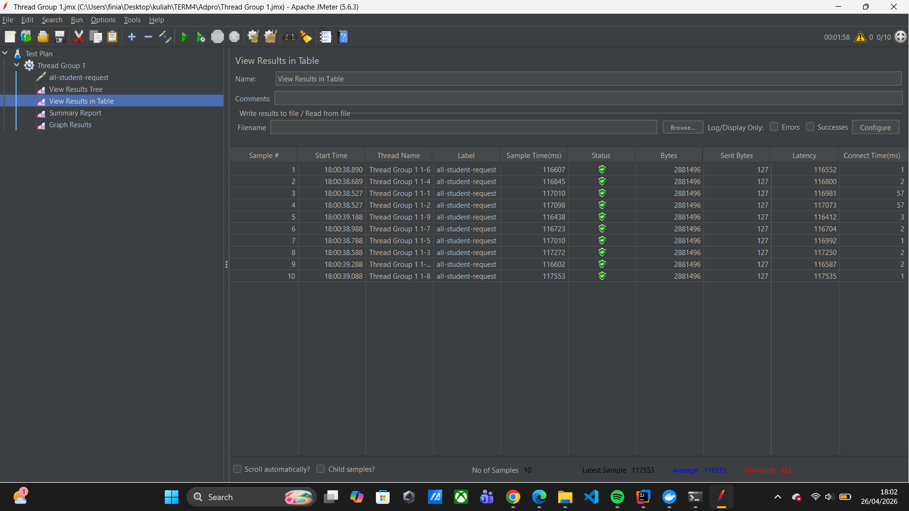
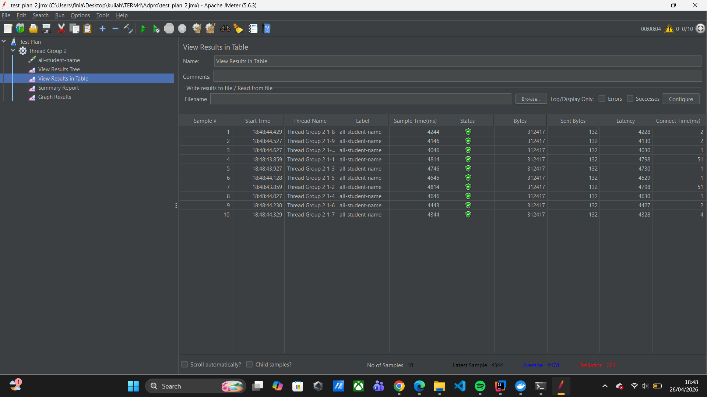
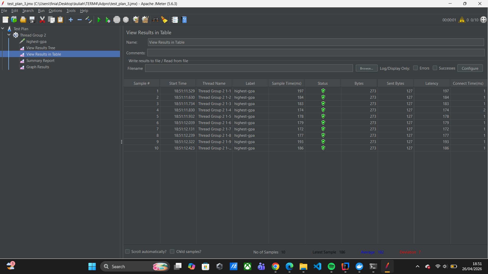
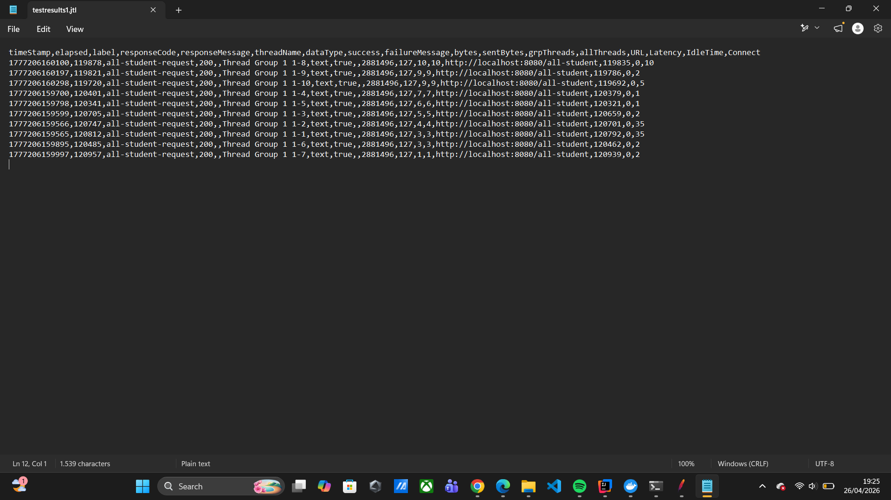
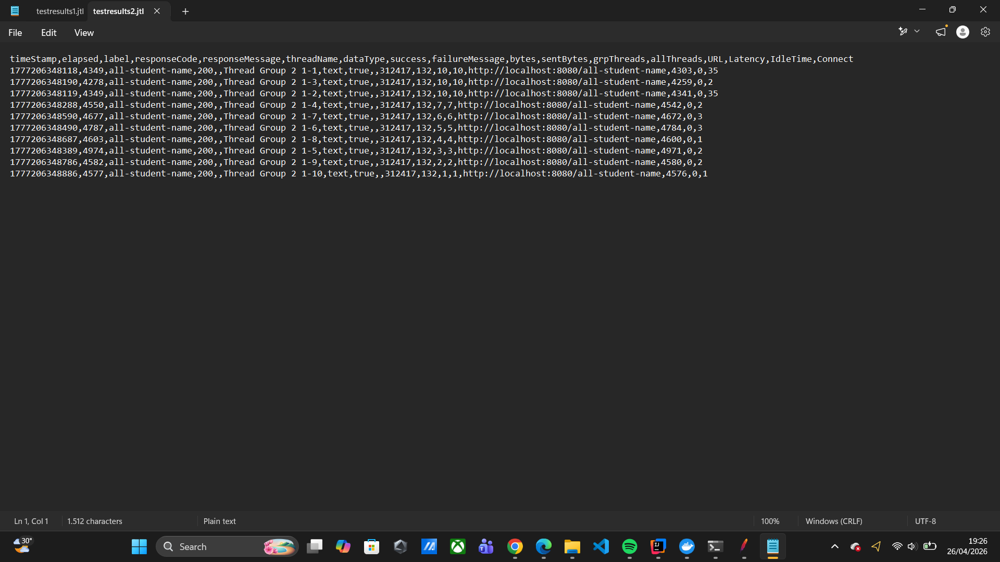
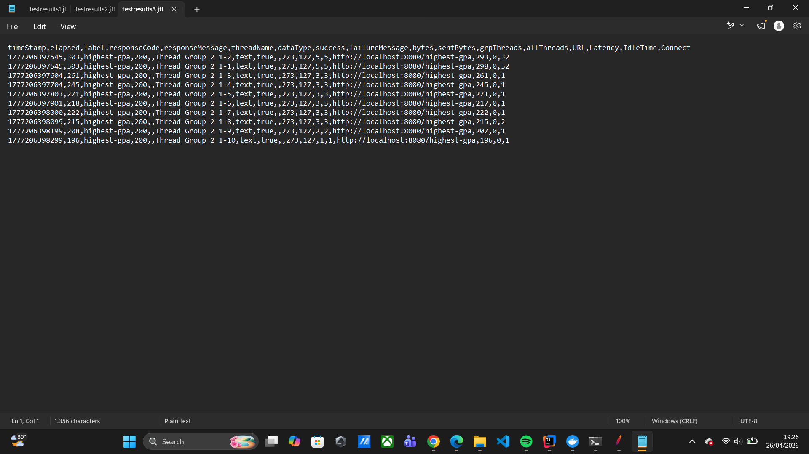
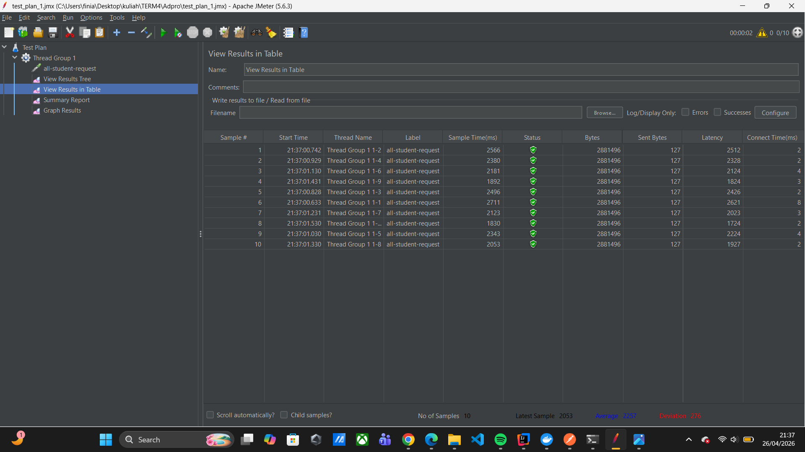
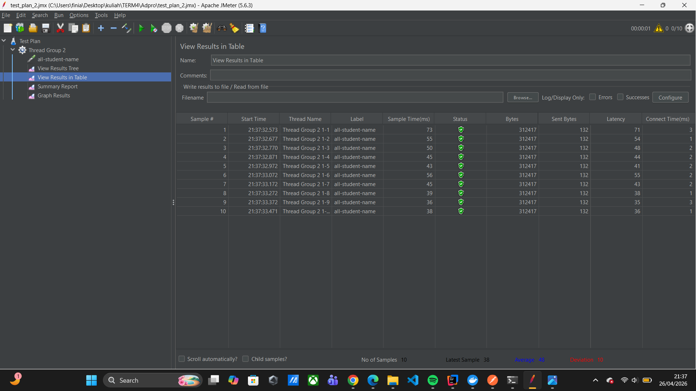

# Performance Testing & Profiling - Tutorial ADPRO

## Baseline Performance (Before Optimization)

### Endpoint `/all-student`

- **Average Sample Time:** 116915 ms

### Endpoint `/all-student-name`

- **Average Sample Time:** 4478 ms

### Endpoint `/highest-gpa`

- **Average Sample Time:** 182 ms

### CLI Execution (Before)

---

## After Optimization (JOIN FETCH + Projection)

### Endpoint `/all-student`

- **Average Sample Time:** 2257 ms
- **Improvement:** 98.1% ✅ (target >20%)

### Endpoint `/all-student-name`

- **Average Sample Time:** 48 ms
- **Improvement:** 98.9% ✅ (target >20%)

### Endpoint `/highest-gpa`

- **Average Sample Time:** 23 ms
- **Improvement:** 87.4% ✅ (target >20%)

---

## Reflection Questions

**1. What is the difference between the approach of performance testing with JMeter and profiling with IntelliJ Profiler in the context of optimizing application performance?**

Perbedaan utamanya terletak pada cakupan pengujiannya. JMeter melakukan pengujian dari sisi eksternal dengan menyimulasikan *traffic user* secara nyata untuk mengukur waktu respons API (*throughput* dan *latency*). Sedangkan IntelliJ Profiler melakukan pendekatan secara internal dengan menganalisis secara langsung proses di dalam aplikasi (penggunaan memori, alokasi *thread*, dan waktu eksekusi tiap *method*) untuk mencari akar masalah yang menyebabkan lambatnya respons tersebut.

**2. How does the profiling process help you in identifying and understanding the weak points in your application?**

Proses *profiling* sangat membantu karena menyediakan visualisasi konkret seperti *Flame Graph* dan *Method List*. Fitur *recording* pada *profiler* merekam alur eksekusi aplikasi, sehingga kita dapat langsung menunjuk (*pinpoint*) baris kode atau fungsi spesifik mana yang menghabiskan waktu eksekusi paling lama (*bottleneck*), tanpa harus menebak-nebak di mana letak inefisiensinya.

**3. Do you think IntelliJ Profiler is effective in assisting you to analyze and identify bottlenecks in your application code?**

Ya, sangat efektif untuk mendiagnosis masalah di level kode. Namun, penggunaannya tidak bisa berdiri sendiri. Kita tetap membutuhkan *tools* pengujian eksternal seperti JMeter untuk memvalidasi apakah perbaikan kode yang kita temukan dari *profiler* benar-benar memberikan dampak perbaikan yang signifikan pada sisi pengguna (*user experience*).

**4. What are the main challenges you face when conducting performance testing and profiling, and how do you overcome these challenges?**

Tantangan utama saat *profiling* adalah menginterpretasikan *timeline* eksekusi yang dipenuhi warna merah (*waiting thread*) dan mencari tahu pemicunya. Sedangkan pada JMeter, tantangannya adalah konfigurasi eksekusi via *Command Line* (CLI) yang rentan mengalami *error* akibat kesalahan *path*. Cara saya mengatasinya adalah dengan mempelajari konsep dasar operasi *Thread/I/O* di Java, serta selalu memastikan penulisan *absolute/full path* direktori saat menggunakan CLI.

**5. What are the main benefits you gain from using IntelliJ Profiler for profiling your application code?**

Manfaat utamanya adalah kemampuan untuk membedakan antara *Total Time* dan *CPU Time*. Hal ini memberikan *insight* krusial bahwa metode yang lambat tidak selalu karena kerja CPU yang berat, melainkan seringkali disebabkan oleh *thread* yang sedang menganggur menunggu *I/O (Input/Output)*, seperti menunggu antrean eksekusi *query database*.

**6. How do you handle situations where the results from profiling with IntelliJ Profiler are not entirely consistent with findings from performance testing using JMeter?**

Jika terjadi inkonsistensi, langkah pertama adalah menyadari efek *Cold Start* pada JVM (JIT *Compiler* yang belum optimal saat aplikasi baru dijalankan). Saya mengatasinya dengan melakukan "pemanasan" (*warm-up*) dengan melakukan beberapa *request* API secara manual sebelum perekaman profil atau pengujian JMeter dimulai. Saya juga memastikan tidak ada program berat lain yang berjalan di *background* saat pengujian berlangsung.

**7. What strategies do you implement in optimizing application code after analyzing results from performance testing and profiling? How do you ensure the changes you make do not affect the application's functionality?**
* Mencegah *N+1 Query Problem* dengan menggunakan `JOIN FETCH` pada Spring Data JPA.
* Menerapkan *Projection* (hanya mengambil kolom spesifik) untuk menghemat penggunaan memori.
* Mendelegasikan tugas komputasi berat seperti *sorting* secara langsung ke tingkat *Database*.

Untuk memastikan fungsionalitas tidak terpengaruh, saya memastikan *return type* fungsi tidak berubah dan melakukan *testing* ulang terhadap *endpoint* (misal melalui *browser* atau Postman) untuk memverifikasi bahwa respons *body* JSON yang dihasilkan sama persis dengan sebelum dioptimasi.